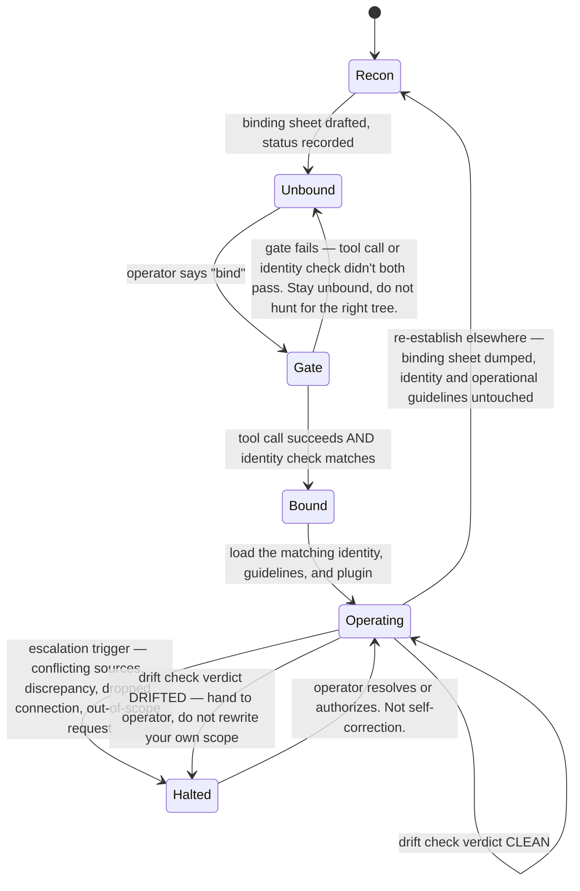

# Domain knowledge boundaries

**Read this first.** Before opening any file in `dk0/`, before pasting the establishment prompt, before drafting a DK:1 plugin — read this one. It is the entry point for this folder, not a fourth asset.

This card defines the boundary between reusable box assets, domain knowledge, and project context. It names no specialty. It never will — if a future edit adds a specialty name here, that edit is wrong.

## HQ box assets — no domain knowledge

A reusable box asset carries identity or operational process only. It knows:

- Its role identity (manager, assistant, or record-keeper) and/or its operational job.
- Its session gate, its subtree/scope lock, its escalation thresholds.
- Generic operating rules: how to name things, when to ask instead of assume, when to halt and hand to a human.

A box asset does **not** know:

- Any regulation, statute, licensing body, or professional practice standard.
- Any named field of work, named client, or named org.
- Any register, alias file, or scheme that belongs to one org — it is told those exist and where to look; it does not arrive knowing their content or shape.

Test: if the identity or guideline would be reusable across projects in that role, it is a box asset. If a sentence only makes sense once you know the field the organisation operates in, it belongs in domain knowledge, not in the box asset.

## Domain knowledge and DK:1 plugins

A domain knowledge source supplies the content for a DK:1 plugin. The source links directly to the plugin; it is not an operational filter and does not become project context. The plugin knows:

- The governing rules of one field of work — legislation, regulatory guidance, licensing conditions, or an equivalent professional practice standard for that field.
- The vocabulary, document types, and compliance checkpoints specific to that field.
- How those rules change what "correct" looks like for the underlying identity and operational-guideline job (what counts as a complete file, what a valid record must contain, what a compliant claim looks like).

A domain knowledge plugin does **not**:

- Replace the identity or operational guidelines. It attaches to them.
- Invent the source rules it cites. If the governing text is not held here, the card says so instead of guessing at it.
- Carry a live org's data. Domain knowledge is still org-stripped; a bound org is a separate instance layer, not part of the DK class itself.

Test: if a sentence is only true because of a law, standard, or licensing rule specific to one field, it belongs in the domain source/plugin, not in the identity or operational guidelines underneath it.

## The separation, in one line

**Box asset = who the role is and how it operates. Domain knowledge plugin = what the role must satisfy because of the field. Project context = which client, system, scope, and facts apply now.**

## What a plugin actually is

The "domain knowledge plugin" node (see `map.md`) is not a fourth identity and not a mini agent. It is **multi-directional task scaffolding** — the packaged, attachable form of a domain knowledge source, built to attach to a selected identity and its operational guidelines and detach again.

The point of scaffolding instead of a graft: without it you end up managing split assets by hand, with half-finished domain edits held everywhere and no clean way back to the generic identity and operational guidelines. A plugin is how domain knowledge gets added without that mess.

The box assets plus a plugin are still not a deployed agent. The **DK:1 agent benchmark** exists only when the selected identity, operational guidelines, and plugin combine with project-specific context in the founder's admin seat, inside whichever workspace the deployment serves.

A plugin only earns the name if it can answer two questions honestly, at any time:

1. **"What if I need to dismantle this?"** Can it be removed cleanly, leaving the identity and operational guidelines generic as before? If detaching it breaks either box asset or leaves orphaned assumptions behind, it was never a plugin — it was a graft, and grafts don't go on the shelf.
2. **"Am I operating within my own recorded boundaries?"** Can the deployed agent check its current behaviour against what's written in the plugin and the box assets underneath it? A plugin that can't audit itself against its own recorded scope isn't scaffolding — it's domain content bolted on with no way to catch drift.

If a piece of domain knowledge can't pass both tests, it isn't ready to ship as a plugin. Keep refining it before it attaches to an identity and its operational guidelines.

The literal, run-it-yourself version of test 2 is [`drift-check.md`](drift-check.md).

## Where the benchmark actually lives

The HQ library is where identities, operational guidelines, and domain knowledge plugins are built and packaged. They remain box assets plus domain knowledge while they are there.

The DK:1 agent benchmark is always created in the founder's own admin seat — that part never varies. What varies is which workspace that seat sits inside: a served client's system for a client-facing asset, or the founder's own business systems for a founder-facing asset (one that grows or runs JYOps itself rather than serving an NDIS provider). Either way, the selected box assets combine with project-specific context in that seat, then are tested against supervised work. The deployment workspace is the benchmark surface; HQ receives only sanitized learning.

This keeps reusable founder assets separate from the project facts that make one deployment specific. A deployed agent is an instance and a benchmark, not a replacement for the HQ library, whether the workspace it's deployed into belongs to a client or to the founder's own business.

## Getting good is not drift

A box asset or deployed agent that gets very good at running against one org for three years has not become that org's asset — not if it was built right. Skill and specificity are different axes:

- **Skill** is getting better at the reusable role and operational process itself: reading a messy root correctly on sight, applying the backdated/future batch defaults without hesitation, catching an overlap and calling it an adjustment instead of a trim, escalating cleanly instead of guessing. None of that is project context. It is the box asset or deployed role, done well.
- **Specificity** is a fact from that org leaking into a reusable identity, guideline, or plugin instead of staying in project context — a register's exact shape hardcoded, a naming habit that only makes sense because of one org's folder quirks.

Only specificity is drift. Skill is not. A reusable asset can spend three years getting excellent at one org and still be deployed to a new project with zero ill effect from that history, because the years of use never touched the identity, operational guidelines, or plugin — they touched project context and the operator's confidence in it. If a new deployment breaks something, that is proof specificity leaked in along the way. It is not proof that getting good at a job is dangerous.

Three years proving a deployed agent against one benchmark isn't three years of building that benchmark's tool. It's three years of stress-testing a reusable identity, operational guidelines, and plugin against a real, demanding project — which is the best kind of evidence the HQ library can receive.

## Boundary failures to watch for

- An identity or operational guideline starts describing a specific register, claim type, or compliance checkpoint → that content has drifted into domain knowledge or project context and must move out.
- A domain knowledge plugin starts repeating the identity or operational-guideline rules (session gate, naming, escalation) instead of attaching to them → duplication; the plugin should reference the box assets, not restate them.
- A domain knowledge plugin invents the rule it cites because the real source text isn't available → stop and say the source is missing. Do not fabricate governing text.
- An operator asks a box asset to "just handle" something that requires knowing a field's rules → that request needs the matching domain knowledge plugin, or it needs a human, not an improvising box asset.

## Where this sits

This file lives beside the reusable operating assets because it describes the seam between identities/guidelines, domain knowledge/plugins, and project context, wherever those assets are stored.

## This is a state machine

Every rule above is a state, a transition, or a guard. It was written as prose because that's what a human and a chat agent both read, but it only holds together because it's a state machine underneath:

No transition skips its guard. There is no edge from `Recon` straight to `Bound`, none from `Gate` to `Operating` bypassing a real tool call, and none from `Halted` back to `Operating` except through a human. Every "do not," "stop," and "stay X" in every card in this folder is a missing edge on this diagram, on purpose.

That last edge, `Operating → Recon`, is the one easiest to misread as a loss. It isn't losing anything — it's the machine doing exactly what it was built to do. The binding sheet was deliberately kept as disposable, non-secret, instance-scoped facts (see "Getting good is not drift," above) so that this exact transition costs nothing: the context dumps, the identity and operational guidelines that were operating a moment ago load again unchanged on the other side, because none of what made them good at the job was ever stored in the thing that just got dumped. Moving from one role, or one org, to another isn't a migration this machine has to survive. It's the transition the whole design was pointed at.
