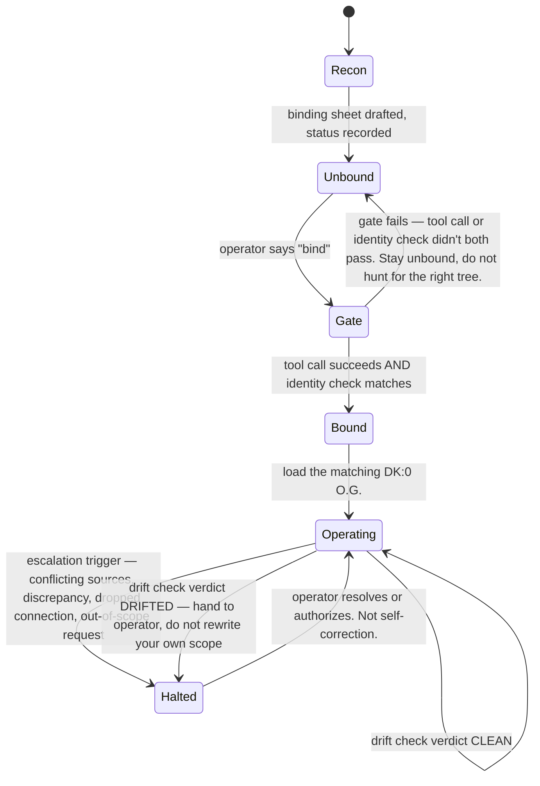

# Domain knowledge boundaries

**Read this first.** Before opening any file in `dk0/`, before pasting the establishment prompt, before drafting a DK:1 plugin — read this one. It is the entry point for this folder, not a fourth asset.

This card defines the line between **DK:0** and a **positive DK class**. It names no specialty. It never will — if a future edit adds a specialty name here, that edit is wrong.

## DK:0 — no domain knowledge

A DK:0 asset carries **process only**. It knows:

- Its job (file hands, billing/recordkeeping chat, a bound external service — whatever the asset is).
- Its session gate, its subtree/scope lock, its escalation thresholds.
- Generic operating rules: how to name things, when to ask instead of assume, when to halt and hand to a human.

A DK:0 asset does **not** know:

- Any regulation, statute, licensing body, or professional practice standard.
- Any named field of work, named client, or named org.
- Any register, alias file, or scheme that belongs to one org — it is told those exist and where to look; it does not arrive knowing their content or shape.

Test: if the card's instructions would be true and complete for **any** organisation running that job, it is DK:0. If a sentence only makes sense once you know the field the org operates in, it does not belong on a DK:0 card.

## Positive DK class (DK:1, DK:2, ...)

A positive DK class adds domain knowledge on top of a DK:0 asset. It knows:

- The governing rules of one field of work — legislation, regulatory guidance, licensing conditions, or an equivalent professional practice standard for that field.
- The vocabulary, document types, and compliance checkpoints specific to that field.
- How those rules change what "correct" looks like for the underlying DK:0 job (what counts as a complete file, what a valid record must contain, what a compliant claim looks like).

A positive DK class does **not**:

- Replace the DK:0 asset's process rules. It clips onto them.
- Invent the source rules it cites. If the governing text is not held here, the card says so instead of guessing at it.
- Carry a live org's data. Domain knowledge is still org-stripped; a bound org is a separate instance layer, not part of the DK class itself.

Test: if a sentence is only true because of a law, standard, or licensing rule specific to one field, it belongs in the positive DK class, not on the DK:0 card underneath it.

## The separation, in one line

**DK:0 = how to do the job in any org. Positive DK = what the job must satisfy because of the field it's done in.**

## What a plugin actually is

The "optional DK:1 plugin" node (see `map.md`) is not a fourth asset and not a mini agent. It is **multi-directional task scaffolding** — the packaged, attachable form of a positive DK class, built to clip onto a DK:0 asset and detach again.

The point of scaffolding instead of a graft: without it you end up managing split assets by hand, with half-finished domain edits held everywhere and no clean way back to plain DK:0. A plugin is how domain knowledge gets added without that mess.

A DK:0 asset with a plugin attached is the **DK:1 agent benchmark** — the live pairing under test, before anyone commits to a whole standalone DK:1 agent.

A plugin only earns the name if it can answer two questions honestly, at any time:

1. **"What if I need to dismantle this?"** Can it be removed cleanly, leaving the DK:0 asset exactly as generic as before? If detaching it breaks the base asset or leaves orphaned assumptions behind, it was never a plugin — it was a graft, and grafts don't go on the shelf.
2. **"Am I operating within my own recorded boundaries?"** Can the combined agent check its current behaviour against what's actually written in the plugin and the DK:0 card underneath it? A plugin that can't audit itself against its own recorded scope isn't scaffolding — it's domain content bolted on with no way to catch drift.

If a piece of domain knowledge can't pass both tests, it isn't ready to ship as a plugin. Keep refining it before it clips onto anything.

The literal, run-it-yourself version of test 2 is [`drift-check.md`](drift-check.md).

## Where the benchmark actually lives

A DK:0 + plugin pairing doesn't get proven on a bound, named-actor seat. It gets proven on the founder's own seat.

**The founder's seat is the asset benchmark library.** It's the one persistent place where DK:0 assets — and later, DK:1 plugins — get built, iterated, and tested, across whatever org happens to be this week's live test case. Org-labelled folders inside that seat are test cases, not instances. A pairing only becomes an instance once it's proven there and establishment binds it to a named actor on a seat dedicated to that org.

This is why a founder's seat can look, from the outside, like it belongs to one org — folder names inside it will often say so, because that org supplied the live test case. It doesn't belong to that org. The seat belongs to the shelf. The org is just today's benchmark.

## Boundary failures to watch for

- A DK:0 card starts describing a specific register, claim type, or compliance checkpoint → that content has drifted from DK:0 into domain knowledge and must move out.
- A positive DK class starts repeating the DK:0 process rules (session gate, naming, escalation) instead of clipping onto them → duplication; the positive class should reference the DK:0 card, not restate it.
- A positive DK class invents the rule it's citing because the real source text isn't available → stop and say the source is missing. Do not fabricate governing text.
- An operator asks a DK:0 asset to "just handle" something that requires knowing a field's rules → that request needs the matching positive DK class, or it needs a human, not an improvising DK:0 asset.

## Where this sits

This file lives in the same folder as the DK:0 assets because, at the time of writing, DK:0 is the only class with assets on the shelf. When a positive DK class gets its own folder, this file's rule does not move — it describes the seam between whichever folders hold DK:0 and the positive class, wherever those folders end up.

## This is a state machine

Every rule above is a state, a transition, or a guard. It was written as prose because that's what a human and a chat agent both read, but it only holds together because it's a state machine underneath:

No transition skips its guard. There is no edge from `Recon` straight to `Bound`, none from `Gate` to `Operating` bypassing a real tool call, and none from `Halted` back to `Operating` except through a human. Every "do not," "stop," and "stay X" in every card in this folder is a missing edge on this diagram, on purpose.
