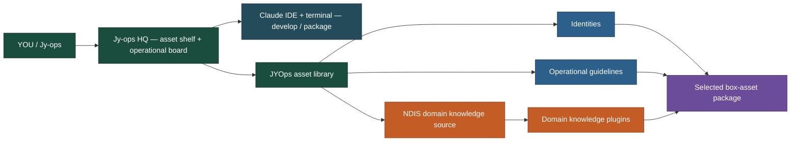
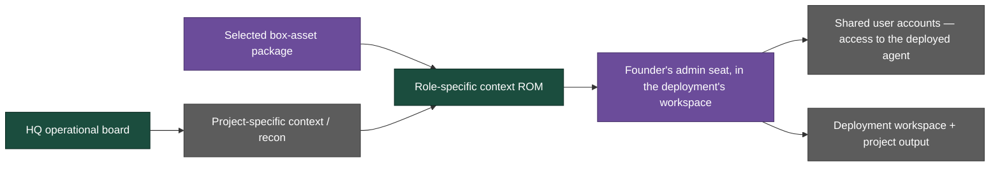
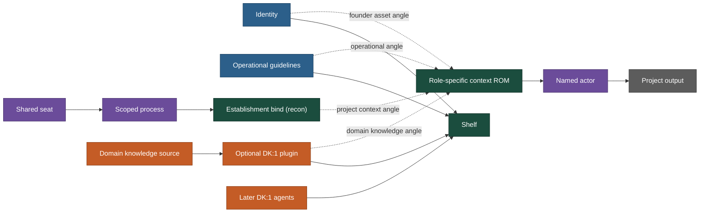

# Map

This repo is founder HQ (Jy-ops). Not a client project. Not the shopfront.

Workspace definition: [`workspace.md`](workspace.md). This map shows the architecture; the charter states what belongs in this repo and where each kind of work ultimately lands.

The HQ asset library has three separate asset classes:

1. **Identities** — domain managers, domain assistants, and domain record-keepers.
2. **Operational guidelines** — reusable role instructions with no project-specific context.
3. **Domain knowledge plugins** — domain knowledge that gives an identity and its guidelines a positive knowledge class.

Domain knowledge is the direct source for a plugin. It is not an operational filter. The identity, operational guidelines, and plugin remain separate box assets until deployment.

An agent is not fully made — and the DK:1 agent library is not benchmarked — until those assets combine with project-specific context in the founder's admin seat, inside whichever workspace that deployment serves (a client's system, or the founder's own business).

NDIS is domain knowledge because of legislative governance (NDIS Rules 2018, practice guidelines, operational governance). Do not invent statute text. Do not sand that off when stripping org names.

The client is the project-level destination. Client names and benchmarks belong in the instance layer, not the top-level operating map. Orange pays rent. Grey is not the chair.

## Founder map

The architecture is split into separate processes. The asset process does not contain client deployment, and the client deployment process does not redefine the asset.

### Process A — build and package the JYOps asset library

This process happens in the founder's HQ. The output is a selected box-asset package ready to be combined with project context in a client deployment. It is not yet a deployed agent.



The direct relationship is:

```text
Domain knowledge source → domain knowledge plugin
Identity + operational guidelines + plugin → selected box-asset package
```

### Process B — combine, deploy, and benchmark an agent

This process starts with box assets and adds project-specific context. The resulting deployment is the benchmark of the DK:1 agent library.



The deployment split is:

```text
Proven JYOps package
        +
Project-specific context
        ↓
Role-specific context ROM
        ↓
Founder's admin seat, in the deployment's workspace
        ↓
Shared user accounts — access to the deployed agent
```

The deployment's users receive shared access to the deployed agent. They do not own the reusable JYOps assets, the domain knowledge source, or the HQ library.

### Separate process — market and public surface

Marketing and public delivery are coordinated from HQ but run separately:

```text
HQ offer / claims definition
        ↓
Grok bots on founder's phone — [`grokbot.md`](grokbot.md)
        ↓
personal-ops + Cloudflare
        ↓
Landing pages + live support chat
```

The founder's own seat is where the asset library is built and packaged. The deployed workspace — a client's system, or the founder's own business — is where the combined assets are benchmarked as an agent, always through the founder's admin seat. Org-labelled folders in the founder seat are test cases, not instances. See [`dk0/domain-knowledge-boundaries.md`](dk0/domain-knowledge-boundaries.md#where-the-benchmark-actually-lives).

MCP placeholder hangs off the asset process. It is not bound until establishment.
The PBS pack stays packed and is not approved as a client deployment.
The shopfront hangs off HQ, not through the asset library. It is a separate public surface coordinated by HQ and executed in `personal-ops`.

Orange pays rent. Grey is not the chair. Everything shelf-side runs through the founder's seat before anything gets bound.

## Operational destination

Jy-ops HQ is both the asset shelf and the main operational board. Claude works here through the IDE and terminal: planning, development, packaging, deployment preparation, client onboarding design, and operating decisions.

Execution then fans out:

- Grok bots on the founder's phone execute the marketing and advertising campaign.
- `jyoperatives/personal-ops` and its Cloudflare deployment run the landing pages and live support chat.
- Bound client projects and approved connectors perform the client's actual document, billing, or service work.
- Client-owned systems hold the resulting files, records, claims, and other deliverables.

HQ remains the source of truth for reusable assets, definitions, readiness, gates, and handoffs. These external surfaces execute or publish work; they do not replace the board.

```text
Asset process: HQ box assets → develop → select/package
Deployment process: box-asset package + project context → deploy → benchmarked agent / client output
Market process: HQ definition → campaign/website execution → public surface
```

## Where the work ends up

This repo holds both the operational board and the reusable founder layer. It does not absorb live client data.

- **Here:** plans, decisions, DK:0 assets, DK:1 plugins, architecture, development, packaging, deployment gates, claim definitions, and safe instance notes.
- **Founder asset library:** the founder's seat where box assets are built, organised, and packaged without becoming an org's property.
- **Bound project:** the served org's Claude Team project — a client's, or the founder's own — with a role-specific context ROM and a named actor.
- **Connected system:** the approved document store, billing CRM, or MCP service where the actor performs its actual work.
- **Client output:** the organisation's files, records, claims, and other approved project deliverables.
- **Separate shopfront:** `jyoperatives/personal-ops`, where public copy and the Cloudflare deployment live.
- **Private archive:** restore-point snapshots, kept outside this repo and outside the client org.

The handoff is therefore not "HQ becomes the deployment's system." It is:

```text
proven HQ package + project context
  → role-specific context ROM
  → founder's admin seat, in the deployment's workspace
  → shared user accounts / deployment output
```

Public copy follows a separate line:

```text
HQ definition → claims check → shopfront repo → public deployment
```

## Birth recipe

For deployment, three independent inputs meet at establishment:

```text
Identity + operational guidelines
Domain knowledge source → DK:1 plugin
Project-specific recon/context
        ↓
Establishment bind
        ↓
Role-specific context ROM
        ↓
Named actor in founder's admin seat
        ↓
Shared access / project output
```

The ROM joins the identity, operational guidelines, domain knowledge plugin, and one project's recon context at bind time. These remain separate sources rather than one fused blob, so a bad domain update or corrupted project context does not rewrite the reusable identity or guidelines. This is what makes actors reproducible: the founder asset half is constant and isolated across every client; only the project-context half varies per bind. Scaling means selecting from the same HQ asset library, not rebuilding the founder layer per client.

The shelf gets identities, operational guidelines, and domain knowledge plugins now. A DK:1 agent exists only after those box assets combine with project context in the founder's admin seat, inside whichever workspace the deployment serves, and the deployment is benchmarked. Swarm = more seats on a named binding. Not before one real DK:1 exists.

The plugin node is scaffolding, not a mini agent. It must dismantle cleanly from the identity and operational guidelines and pass its own recorded-boundary check, or it isn't ready to attach. See [`dk0/domain-knowledge-boundaries.md`](dk0/domain-knowledge-boundaries.md).



Four arrows into the ROM, not one chain: identity, operational guidelines, domain knowledge, and project context each attach independently. Trace a break back to its own box asset or angle instead of tearing down the whole actor.

Establishment is recon, then bind. Not a domain. Do not use a reserved mermaid id (`end`) for the dump.
