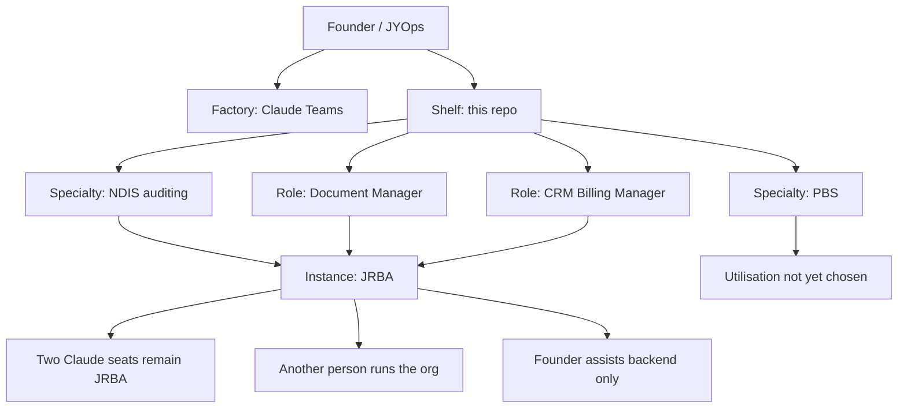
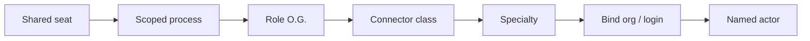

# Map

Founder centre is **JYOps**. Claude Teams is the factory. This repo is the shelf.

JRBA is a project instance, not the hub.

## Founder → specialties → roles → instance

PBS has no project instance yet. Do not draw one.

## Birth recipe

A shelf asset is born in this order. Binding and the named actor come last.

| Step | Lives | Notes |
| --- | --- | --- |
| Shared seat | Factory | Extra seats only if the project already brings in money. |
| Scoped process | Factory + O.G. | What the actor is allowed to do. |
| Role O.G. | Shelf (`roles/`) | Org-stripped rules. |
| Connector class | Shelf, then bind | e.g. document-store subtree, billing CRM — not a folder ID. |
| Specialty | Shelf (`specialties/`) | Domain, not a client. |
| Bind org / login | Instance / factory | Secrets stay out of this repo. |
| Named actor | Factory | The bound seat on that instance. |

**Shelf** = role O.G. + specialty + connector class (org-stripped).

**Swarm** = more seats on a named binding, not employee CVs.

Work-history files are not part of the recipe.
