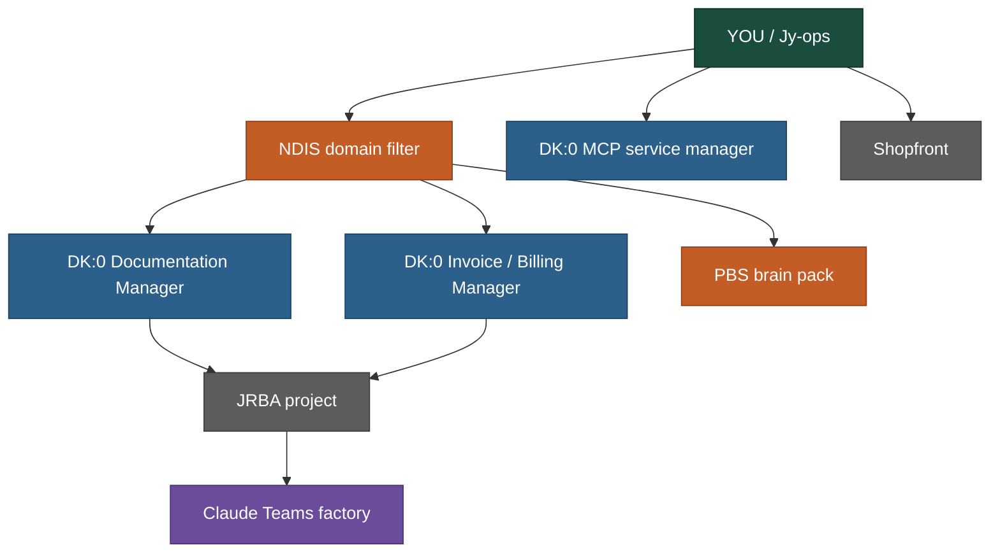
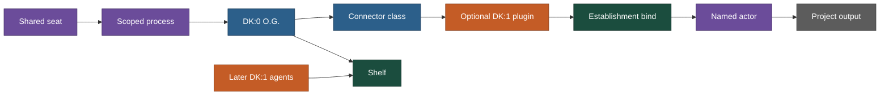

# Map

This repo is founder HQ (Jy-ops). Not JRBA. Not the shopfront.

DK:0 = no domain knowledge. Three separate assets: Documentation Manager (file hands), Invoice / Billing Manager (plain-English CRM chat + billing), MCP-connected service manager (placeholder until bind). DK:0 cards never name a specialty.

DK:1 = NDIS. First as plugins clipped onto DK:0. After a deploy proves it, dissect by role into DK:1 agents — whole NDIS-scoped actors, not a plugin drawer.

NDIS is domain knowledge because of legislative governance (NDIS Rules 2018, practice guidelines, operational governance). Do not invent statute text. Do not sand that off when stripping org names.

JRBA is one project. Gym/benchmark. Not the chair. Orange pays rent. Grey is not the chair.

## Founder map

YOU → NDIS domain filter → two bound DK:0 roles + PBS pack → JRBA → Claude Teams factory.

MCP placeholder hangs off YOU. Blue. Not bound. No edge to JRBA until establishment.

Shopfront hangs off YOU. Separate. Grey. Not HQ.

PBS pack stays packed. Not approved as a build. No edge to JRBA.

Orange pays rent. Grey is not the chair.

## Birth recipe

Shared seat + scoped process + DK:0 O.G. + connector class + optional DK:1 plugin → establishment bind → named actor → project output (dump).

Shelf gets the DK:0 O.G. now, and DK:1 agents later. Swarm = more seats on a named binding. Not before one real DK:1 exists.

Establishment is recon, then bind. Not a domain. Do not use a reserved mermaid id (`end`) for the dump.
